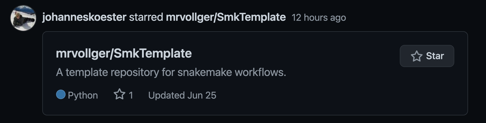

<!-- headingDivider: 2 -->
<style>
  footer {
      height: 10px;
  }
  footer img {
    height: 20px;
    float: center;
  }
  section {
     font-size: 20px; 
  }
  section.small {
    font-size: 18px; 
  }
  b, strong {
     color: #48c;
  }
  h1 {
    font-size: 46px;
  }
  h2 {
     font-size: 32px; 
    /*text-decoration: underline;*/
  }
  h2::before {
    content:"";
    position: absolute;
    border-bottom: 2.8px solid #48c; /*use this to adjust underlin color and size*/
    width:83.6%;  /*use this to adjust underline width*/
    height:1.5em; /*use this to adjust underline position*/
  }
</style>

# Creating publication quality workflows with **Snakemake** and **GitHub**

#### _Mitchell R. Vollger_

## **Who** is this for?

#### This guide is for people who already know the basics of **Snakemake** and **GitHub** and want to increase the usability of their work.

#### You should seriously consider using this guide if you plan to:

- **Reuse** a workflow in the future
- **Share** a workflow with anyone
- **Publish** a workflow

## **What** constitutes a publication quality workflow

- **Documented**
  - The workflow is described as well as all configuration options
- **Portable**
  - Your workflow can be downloaded, installed, and run successfully on a test set in less than ~10 minutes
- **Tested**
  - The workflow (and all changes to the workflow) are tested against a small data set continuously
- **Readable**
  - The code and directory layout are constructed in a readable and expected fashion

## **What** a publication quality workflow looks like

<!-- _class: section small-->

```bash
├── README.md # Must contain keywords snakemake and workflow
├── LICENSE.md # I use MIT
├── workflow
│   ├── rules # snakemake files (must have .smk suffix)
│   │   ├── module.smk
│   ├── envs # conda yaml(s)
│   │   ├── env.yml
│   │   └── R.yaml
│   ├── scripts # scripts used by the workflow
│   │   ├── script.py
│   ├── notebooks
│   │   ├── notebook.py.ipynb
│   ├── report # see the report() function
│   │   ├── plot.rst
│   └── Snakefile
├── config
│   ├── README.md # a complete description of configuration options
│   ├── config.yaml
│   └── manifest.tsv
├── .test # a small test case that runs all rules in your workflow
│   ├── config.yaml
├── .github/workflows # yaml(s) for github actions (Continuous integration)
│   ├── main.yml
│   ├── lint.yml
│   └── black.yml
├── .gitignore
├── .snakemake-workflow-catalog.yml # Specify required flags and options
├── _config.yml # A file that tells github to make a website
└── results # results of the workflow
```

## **How** do I do this, it seems like a lot of work...

#### Don't worry I made it easy by making a template that can serve as the starting point for any Snakemake workflow

- [github.com/mrvollger/SmkTemplate](https://github.com/mrvollger/SmkTemplate)

#### If you are not experienced with **Snakemake** don't worry, it has excellent documentation and tutorials

- [Docs](https://snakemake.readthedocs.io/en/stable/)
- [Tutorial](https://snakemake.readthedocs.io/en/stable/tutorial/tutorial.html)

## Reasons **why** you should aim to make quality workflows

- A provably working Snakemake that is scalable, portable, and readable
- A website for your tool
  - [ \<user\>.github.io/\<workflow>](https://mrvollger.github.io/SmkTemplate/)
- Automated documentation and publication of your workflow on the Snakemake website
  - [snakemake.github.io/snakemake-workflow-catalog?usage=\<user>/\<workflow>](https://snakemake.github.io/snakemake-workflow-catalog?usage=mrvollger/SmkTemplate)
- You will be able to submit to journals like [JOSS](https://joss.readthedocs.io/en/latest/submitting.html) in about an hour
- You get these pretty badges!
  - [](https://github.com/mrvollger/SmkTemplate/actions) [](https://github.com/mrvollger/SmkTemplate/actions) [](https://github.com/mrvollger/SmkTemplate/actions)

## **Why** follow this guide/advice in particular?

#### These recommendations are my attempt at a unified collection of standards suggested by the **Snakemake developers**


(And while this is not a recommendation the creator did star the repo)

# Making a **documented** workflow

## **Documenting**: required files

```bash
├── README.md # Must contain keywords snakemake and workflow
├── config
│   ├── README.md # a complete description of configuration options
│   ├── config.yaml
│   └── manifest.tsv
├── _config.yml # A file that tells github to make a website
└── .snakemake-workflow-catalog.yml # Specify required flags and options
```

- `README.md`: A standard description of your tool
- `config/config.yaml`: A yaml file that has all **options** and **inputs** for your workflow
- `config/README.md`: A **description** all options and inputs for your workflow
- `_config.yml`: This file tells **GitHub** what theme to use when making your website
- `.snakemake-workflow-catalog.yml`:

## **Documenting**: sharing documentation

### Website that displays your README:

[https://\<USER>.github.io/\<REPO>/](https://mrvollger.github.io/SmkTemplate/)

### Usage documentation on the **Snakemake** website:

[https://snakemake.github.io/snakemake-workflow-catalog?usage=\<USER>/\<REPO>](https://snakemake.github.io/snakemake-workflow-catalog?usage=mrvollger/SmkTemplate)

# Making a **readable** workflow

## **Readable**: making your code ready to share

#### Check that you follow **Snakemake** coding recommendations with

`snakemake --lint `

#### Format your **Snakefile** consistently and automatically

`snakefmt .`

#### Format your **python** code consistently and automatically

`black .`

## **Readable**: what should and should not be in your **rules**

#### Should have

- Input and output
- Log file
- Environment declaration if using `shell` or `script`
- `resources` and `threads` if appropriate.

#### Should not have

- Any reference to a system specific resource e.g. `sge`,`grid`,`qsub`, `module load`, ect.
- Global python references e.g. `{SNAKEMAKE_DIR}`.
  - Instead add an option to `params` or use wildcard references e.g. `{wildcards.sample}`

## **Readable**: example **rule**

```python
rule RepeatMasker:
    input:
        fasta="a.fasta",
    output:
        out="a.out",
    resources:
        mem=1048, # in MB by default
    threads: 1
    conda:
        "envs/env.yml"
    log:
        "rm.out.log",
    params:
        species=config.get("RepeatMaskerSpecies", "human"),
    shell:
        """
        RepeatMasker -s -xsmall -e ncbi \
            -species {params.species} \
            -dir $(dirname {input.fasta}) \
            -pa {threads} \
            {input.fasta}  2> {log}
        """
```

# Making a **portable** workflow

## **Portable**: required files

```bash
├── LICENSE.md # I use MIT
├── workflow
│   └── envs # conda yaml(s)
│       └── env.yml
└── .snakemake-workflow-catalog.yml # Specify required flags and options
```

- `LICENSE.md `: However you want to license your tool
- `workflow/envs/env.yml`: A yaml file that contains **conda** dependencies
- `.snakemake-workflow-catalog.yml`: Adds a requirement to use the `--use-conda` flag.

## **Portable**: a conda environment description

`workflow/envs/env.yml`

```yaml
channels:
  - bioconda
  - conda-forge
  - defaults
dependencies:
  - minimap2
  - samtools
  - numpy
  - pandas
```

Every `rule` then specifies the `conda` environment it uses with the `conda:` declaration. Reference multiple environments so you can keep each one simple.

```python
rule example:
    input:
          ...
    conda:
      "envs/python.yml"
    shell:
          "..."
```

## **Portable**: adding required flags

`.snakemake-workflow-catalog.yml`

```yaml
usage:
  # definition of software deployment method:
  # at least conda, singularity, or both
  software-stack-deployment:
    conda: true
```

This file tells your users that they must use `--use-conda` in order to run your workflow. This will allow `conda` to handle all dependencies.

# Making a **tested** workflow

## **Testing**: required files

```bash
├── .github/workflows # yaml(s) for github actions (Continuous integration)
│   ├── main.yml
│   ├── lint.yml
│   └── black.yml
├── .test # a small test case that runs all rules in your workflow
│   ├── config.yaml
│   └── <test data file>
```

- The `<>.yml`s under `.github/workflow` specify actions **GitHub** should take every time a change is made to your repo
  - Basically **GitHub** will test your workflow on AWS or equivalent.
  - This is totally free for open source software!
- The `.test/` directory contains all data and configuration info needed to run a test of your code, and **GitHub** will run this test when you push changes

## **Testing**: setting up continuous integration

Enter the following into `.github/workflows/main.yaml`

```yaml
name: CI
# Controls when the action will run.
on:
  # Triggers the workflow on push or pull request events but only for the main branch
  push:
    branches: [main, master]
  pull_request:
    branches: [main, master]
  # Allows you to run this workflow manually from the Actions tab
  workflow_dispatch:
# A workflow run is made up of one or more jobs that can run sequentially or in parallel
jobs:
  Testing:
    runs-on: ubuntu-latest
    steps:
      - uses: actions/checkout@v2
      - name: Checkout submodules
        uses: textbook/git-checkout-submodule-action@2.0.0
      - name: Test workflow
        uses: snakemake/snakemake-github-action@v1.18.0
        with:
          directory: .
          snakefile: workflow/Snakefile
          args: "--use-conda --cores 1 --configfile .test/config.yaml"
```

## **Testing**: pretty badges in your `README.md`!!!

```markdown
[](https://github.com/<USER>/<REPO>/actions)
```

- **Snakemake** completed successfully!
  [](https://github.com/mrvollger/SmkTemplate/actions)
- **Snakemake** completed **Linting** your workflow and found no issues!
  [](https://github.com/mrvollger/SmkTemplate/actions)
- **black** checked your python code and it is formatted correctly!
  [](https://github.com/mrvollger/SmkTemplate/actions)

# That is all!

### Try out the template!

[**https://github.com/mrvollger/SmkTemplate/**](https://github.com/mrvollger/SmkTemplate/)
